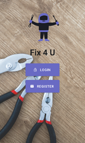

# Fix4U

Hi!
Fix4U a is an app for connect between customers and service providers.
customers can find an available service providers in a fast and easy way, 
and service provider gets a schedule management and new customers appointment offers. 
it was develop using react native,and back4app

for download the app apk [click here](https://expo.io/artifacts/ad9fd40a-a863-4a9a-8d08-d9046997ee26)

sample customer user:
email - barak@e.com
password - 123456

sample service provider user:
email - avi@e.com
password - 123456

## Built With

- [React-Native](https://reactnative.dev/) - React Native is an open-source mobile application framework created by Facebook.
- [Back4App](https://www.back4app.com/) - Back4app is a platform that uses Parse open source for migration alternative, it is a hub for backend where you can build, host and share APIs for web, mobile and IoT.
- [Parse-Server](https://parseplatform.org/) - Parse Server is an open source Backend-as-a-Service(BaaS) framework initially developed by Facebook.
- [MongoDB](https://www.mongodb.com/) - MongoDB is a source-available cross-platform document-oriented database program.
- [Redux](https://redux.js.org/) - Redux is an open-source JavaScript library for managing application state
